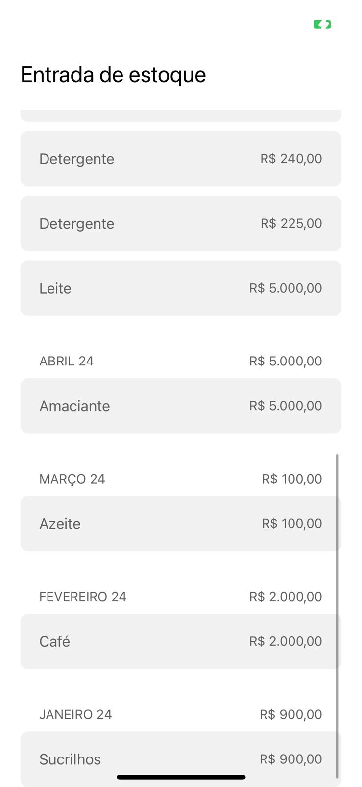

<h1 align="center"> Ordo </h1>

## :memo: Description

College institutional work assigned to inter multidisciplinary project

## :books: Functionalities

- All product functionalities and ideas are archived in this document:
  https://docs.google.com/document/d/1UcoybYRKKgEJYOmPGgOLvt3lGG-ZvkivYmcMfwx6KnY/edit?usp=sharing

## :wrench: Technologies and methods used

- React Native;
- NodeJS
- MySQL
- UML
- SCRUM
- C4 Model
- Figma
- Trello
- Eslint
- Prettier

## :rocket: Running the project

Suggestion: you must have node js installed on your machine and install node modules

```
git clone https://github.com/Molezinif/Ordo.git
cd .\app
npm start
```

## :handshake: Collaborators

<table>
  <tr>
    <td align="center">
      <a href="https://github.com/Molezinif">
        <br>
        <sub>
          <b>Gabriel Molezini</b>
        </sub>
      </a>
    </td>
    <td align="center">
      <a href="https://github.com/victorMartinsFranchi">
        <br>
        <sub>
          <b>Victor Franchi</b>
        </sub>
      </a>
    </td>
  </tr>
</table>

## Screenshots

<div class="image-container">





## :link: Links

- Prototype: https://www.figma.com/community/file/1234335950313725295

## :dart: Project Status

Under development!
